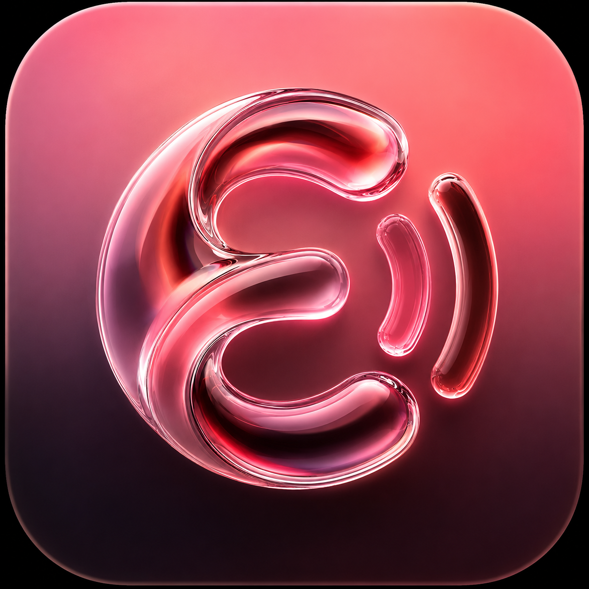

<p align="center">
  
</p>

<h1 align="center">Exhale</h1>

<p align="center">
  <em>A breath of fresh air for your music. A premium, fluid, and open-source Android audio experience.</em>
</p>

<p align="center">
  <a href="https://android.com"></a>
  <a href="https://kotlinlang.org"></a>
  <a href="https://developer.android.com/jetpack/compose"></a>
  <a href="LICENSE"></a>
</p>

---

## ✧ The Vibe & UI Highlights

Welcome to **Exhale** (formerly OpenTune) — a meticulously crafted audio experience designed to make every interaction a delight. 

At the core of Exhale is our signature **Liquid Glass** aesthetic. We've engineered dynamic, animated organic gradient backgrounds that flow beneath heavily frosted glass UI panels, bringing your music to life. 

By blending the fluid, tactile physics and stunning glassmorphism of *Apple Music* with the clean, highly-readable minimalism of *Spotify*, Exhale achieves an unparalleled balance of form and function. 

Feel the music before you even press play with our **buttery-smooth animations**:
- 🌀 **Custom Spring Physics:** Every swipe, scroll, and drag feels natural and deeply responsive.
- ✨ **Tactile Feedback:** Hardware-accelerated, scale-down-on-press micro-animations make the app feel alive under your fingertips.

## 🚀 Key Features

- 🧊 **Liquid Glass UI:** Real-time, high-performance backdrop blur powered by [Haze](https://github.com/chrisbanes/haze).
- 📚 **All-new Modern Library Design:** A completely reimagined, clutter-free way to organize your collection.
- 🎤 **Lyrics V2 Engine:** Perfectly synced, beautiful real-time lyrics that immerse you in the song.
- 💎 **100% Kotlin & Jetpack Compose:** Built strictly with modern Android development standards.
- 🌐 **Seamless Streaming:** Access vast catalogs of music instantly without missing a beat.
- 💾 **Offline Playback:** Download your favorite tracks and take your music anywhere, anytime.
- 🎛️ **Audio Customization:** Built-in equalizer and audio tweaks for the perfect listening experience.
- 🎨 **Dynamic Theming:** UI adapts elegantly to the album art of your currently playing track.

## 📸 Screenshots

<p align="center">
  
</p>

## 📥 Installation

Ready to take a breath of fresh air? You can get Exhale in a couple of ways:

### GitHub Releases
Download the latest `.apk` file directly from our [Releases](https://github.com/ozyern/Exhale/releases) page.

### F-Droid
*Coming soon! Exhale will be available on the F-Droid repository.*
<!-- <a href="https://f-droid.org/packages/com.exhale.app/"></a> -->

## 🛠️ Building from Source

To build Exhale yourself, you'll need [Android Studio](https://developer.android.com/studio). 

1. Clone the repository:
   ```bash
   git clone https://github.com/ozyern/Exhale.git
   ```
2. Open the project in Android Studio.
3. Sync the Gradle files.
4. Hit **Run** (`Shift + F10`) to build and deploy to your emulator or physical device.

## 🤝 Contributing

We believe open source thrives on collaboration. Whether you're fixing bugs, improving the Liquid Glass engine, translating the app, or simply squashing typos, your contributions are incredibly welcome!

Please check out our [Contributing Guidelines](CONTRIBUTING.md) to get started. Don't forget to read our [Code of Conduct](CODE_OF_CONDUCT.md).

---

<p align="center">
  Made with 🩵 for the Android community.
</p>
